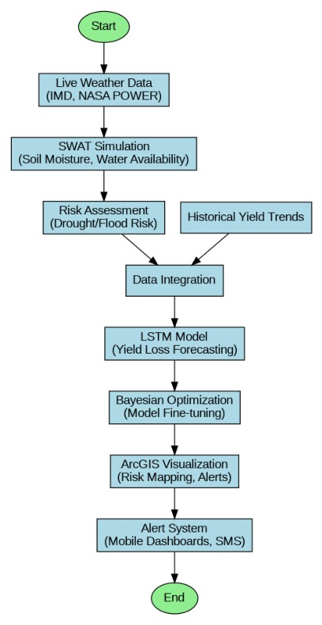

# 🌾 Crop Yield Loss Predictor — Odisha, India

Predicting agricultural yield loss due to climate variability using LSTM and Random Forest models, with a focus on Odisha — a state highly vulnerable to droughts, floods, and cyclones.

---

## 📌 Problem Statement

Climate variability such as unexpected droughts, unseasonal rainfall, and heatwaves significantly impacts agricultural productivity in Odisha. This project predicts crop yield losses under varying climatic conditions using machine learning.

---

## 📂 Dataset

Two datasets are used:

| File | Description |
|------|-------------|
| `crop_yield.csv` | Crop-wise yield data with features: Crop, Season, State, Area, Production, Annual Rainfall, Fertilizer, Pesticide, Yield |
| `data.csv` | Odisha climate data: Year, Rainfall, Temperature, Rice Area, Rice Yield, Cereals Area, Cereals Yield, Calamity Index |

---

## 🧠 Models Used

### 1. LSTM (Long Short-Term Memory)
- Architecture: LSTM layer (64 units, ReLU) → Dense output layer
- Optimizer: Adam | Loss: Mean Squared Error
- Input reshaped for time-series format

### 2. Random Forest Regressor
- Estimators: 100 | Random State: 42
- Feature importance analysis included

---

## 📊 Results

| Metric | LSTM | Random Forest |
|--------|------|---------------|
| MAE | 2.619 | 0.362 |
| RMSE | 6.934 | 1.218 |
| R² | 0.635 | **0.989** |
| Accuracy % | 31.84% | **90.58%** |
| MAPE | 236.61% | 13.47% |

✅ **Random Forest significantly outperforms LSTM** and is recommended for practical use.

---

## 🔄 Workflow



---

## 🚀 How to Run

1. **Clone the repository**
```bash
git clone https://github.com/YOUR_USERNAME/crop-yield-loss-predictor.git
cd crop-yield-loss-predictor
```

2. **Install dependencies**
```bash
pip install -r requirements.txt
```

3. **Launch the notebook**
```bash
jupyter notebook DUAL_MODEL_YIELD_PREDICTOR_DESKTOP.ipynb
```

---

## 📁 Project Structure

```
crop-yield-loss-predictor/
│
├── DUAL_MODEL_YIELD_PREDICTOR_DESKTOP.ipynb   # Main notebook
├── crop_yield.csv                              # Primary dataset
├── data.csv                                    # Odisha climate dataset
├── random_forest_feature_importance.csv        # RF feature scores
├── Flowchart.jpeg                              # System workflow
├── requirements.txt                            # Dependencies
└── README.md
```

---

## 🌍 Context

Odisha is one of India's most climate-vulnerable states. Events like **Cyclone Fani (2019)** and recurring floods in the Mahanadi delta have caused massive crop losses. This project directly addresses that problem using data-driven forecasting.

---

## 👥 Group 1 — Project Team

> B.Tech Project | Agricultural Yield Loss Prediction using ML
